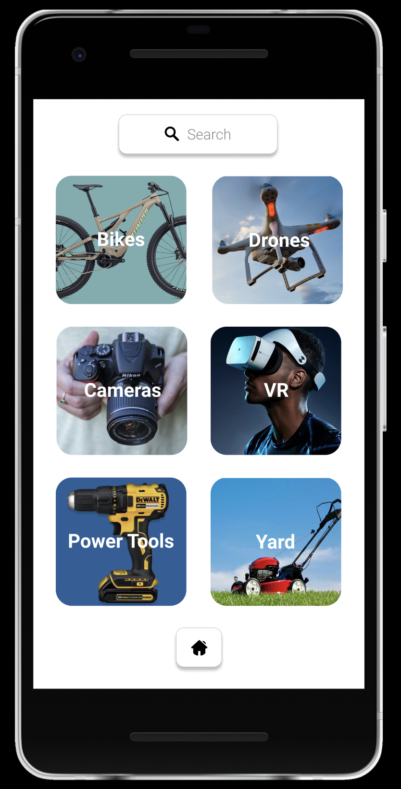
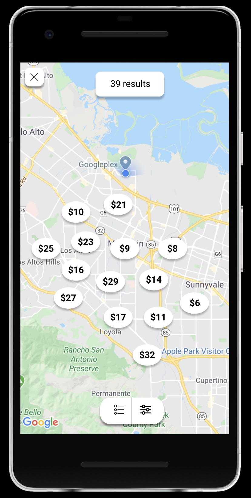
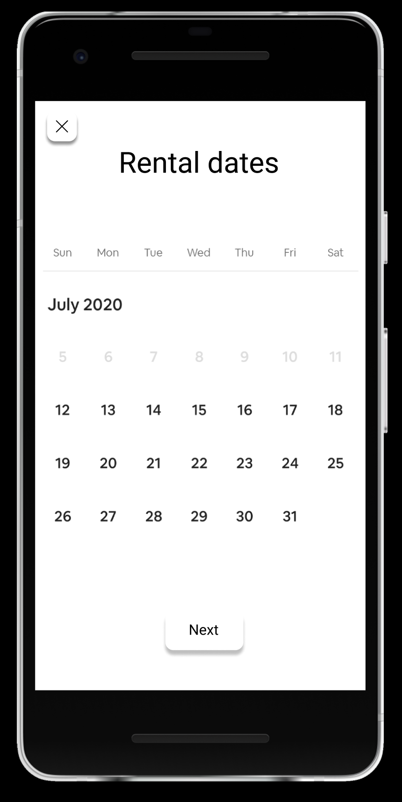
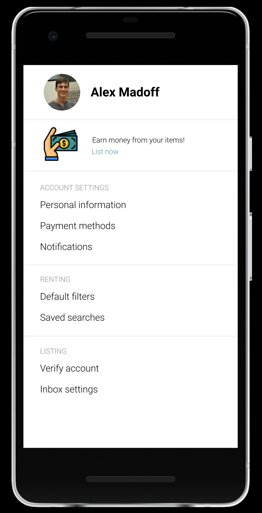

Original App Design Project - README Template
===

# Peer to Peer Renting App

## Table of Contents
1. [Overview](#Overview)
1. [Product Spec](#Product-Spec)
1. [Wireframes](#Wireframes)
2. [Schema](#Schema)

## Overview
### Description
A peer to peer renting app, allowing users to rent and list items:

Listing
- User can list any item they own to earn passive income.

Renting
- User opens the app to satisfy a specific need
    - "I need a powerwasher for the weekend"
- User opens the app to browse (and subsequently rent items) around an experience
    - Weekend outdoors: expands to show assorted camping equipment and a camera drone available for rent

### App Evaluation
[Evaluation of your app across the following attributes]
- **Category:** Peer to peer, rental
- **Mobile:** Uses camera for profile pictures (and potentially for renter validation), uses location to find nearby rentals
- **Story:** Allows users to rent nearby items that they would not be inclined to commit to purchase. Equips users for fun and unique experiences. Allows users to rent items that they don't use regularly to generate passive income.
- **Market:** The target market is composed of users from all income levels.
    - For some, commiting to purchase rarely used items is too expensive, and renting on an as-needed basis is preferred.
    - Others have the spare funds to try novel items and experiences.
    - For anyone, generating additional income from items that are not frequently used is appealing!
- **Habit:**
    - "Retail therapy" and online shopping have been shown to be habit forming behaviors. This app would allow users to satisfy those urges, while still being fiscally responsible (renting is less expensive than buying)
- **Scope:**
    - Dual scope: targeting sellers and renters as users

## Product Spec

### 1. User Stories (Required and Optional)

**Required Must-have Stories**

* User can list items for rent
* User can scroll through tiles of items available
* User can see available items on a map (using Google maps API)
* User can message seller to iron out renting details

**Optional Nice-to-have Stories**

* Users can filter listings by price, location, category, etc
* Profile pages for each user
    * Keeps track of rentable items user has saved
    * Displays items that user has listed for rent
* Users can browse experiences
    * When selected, expand to show a list of rentable items that fuel the particular experience
* Users must upload proof of ID to list items in the app
* Review score for each renter/lender

### 2. Screen Archetypes

* Login/Register
   * User signs up/logs into their account
* Messaging Screen
    * Renter can iron out the details of the rental with the lender
* Homepage/Feed
    * Tiles of items available for rent
* Profile Screen
    * Displays items user has listed
    * Displays saved rentable items

### 3. Navigation

**Tab Navigation** (Tab to Screen)

* Browse/Home
* Profile
* Settings

**Flow Navigation** (Scren to Screen)

Forced Log-in -> Account creation if no log in is available

Item tile -> Item details screen

Profile -> Text field to be modified

Settings -> Toggle settings

<!-- ## Wireframes
 -->

### Digital Wireframes & Mockups
Figma link:
https://www.figma.com/file/lRnlfLkRGGGeKzSYai7g3W/Rent-App-Wireframes?node-id=0%3A1

### [BONUS] Interactive Prototype

<!--
## Schema 
[This section will be completed in Unit 9]
### Models
[Add table of models]
### Networking
- [Add list of network requests by screen ]
- [Create basic snippets for each Parse network request]
- [OPTIONAL: List endpoints if using existing API such as Yelp] -->
