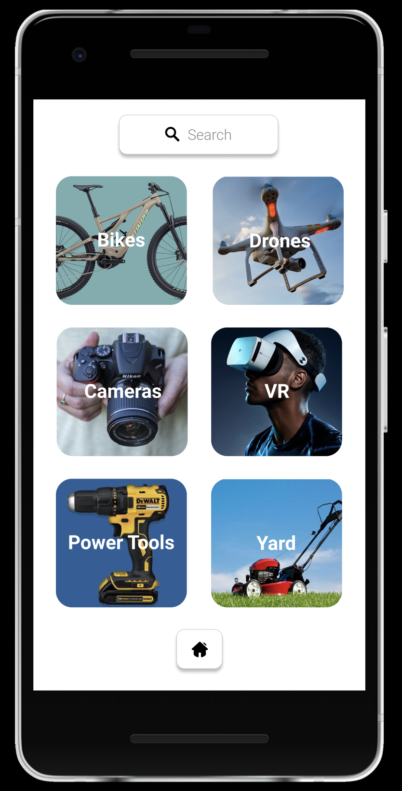
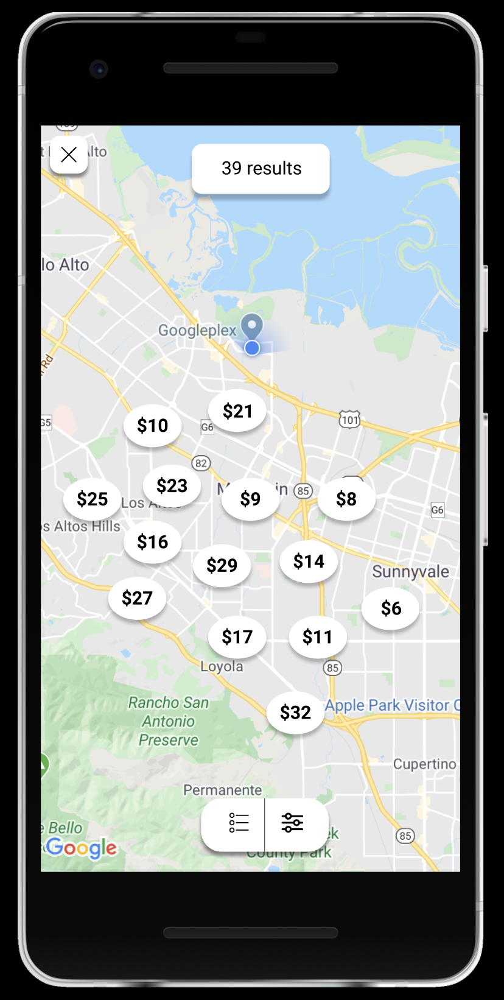
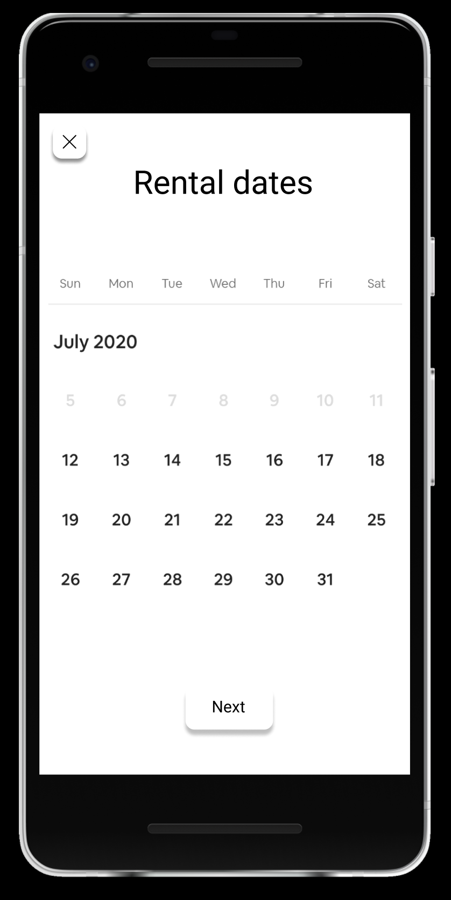
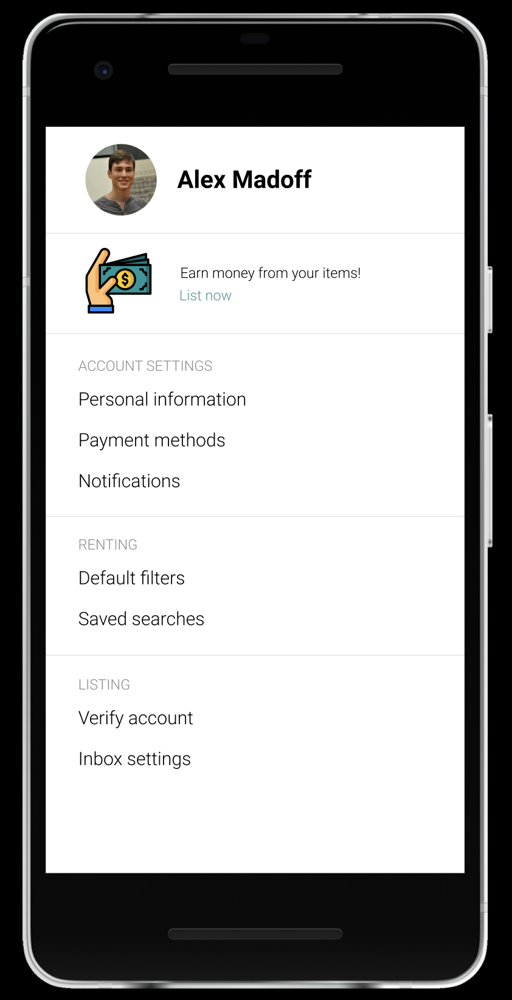

Original App Design Project - README Template
===

# Peer to Peer Renting App

## Table of Contents
1. [Overview](#Overview)
1. [Product Spec](#Product-Spec)
1. [Wireframes](#Wireframes)
2. [Schema](#Schema)

## Overview
### Description
A peer to peer renting app, allowing users to rent and list items:

Listing
- User can list any item they own to earn passive income.

Renting
- User opens the app to satisfy a specific need
    - "I need a powerwasher for the weekend"
- User opens the app to browse (and subsequently rent items) around an experience
    - Weekend outdoors: expands to show assorted camping equipment and a camera drone available for rent

#### Screens Tree
https://github.com/a1madoff/RentingApp/blob/master/Screens%20Tree.png

### App Evaluation
[Evaluation of your app across the following attributes]
- **Category:** Peer to peer, rental
- **Mobile:** Uses camera for profile pictures (and potentially for renter validation), uses location to find nearby rentals
- **Story:** Allows users to rent nearby items that they would not be inclined to commit to purchase. Equips users for fun and unique experiences. Allows users to rent items that they don't use regularly to generate passive income.
- **Market:** The target market is composed of users from all income levels.
    - For some, commiting to purchase rarely used items is too expensive, and renting on an as-needed basis is preferred.
    - Others have the spare funds to try novel items and experiences.
    - For anyone, generating additional income from items that are not frequently used is appealing!
- **Habit:**
    - "Retail therapy" and online shopping have been shown to be habit forming behaviors. This app would allow users to satisfy those urges, while still being fiscally responsible (renting is less expensive than buying)
- **Scope:**
    - Dual scope: targeting sellers and renters as users

## Product Spec

### 1. User Stories (Required and Optional)

**Required Must-have Stories**

* User can sign up for a new account
* User can log in/log out of their account
    * Currently logged in user does not have to re-authenticate
* User can browse tiles of items available
* User can tap on a listing to see details for that listing
* User can see available items on a map (using Google maps SDK)
* User can select the dates for which they would like to rent the item
* User can view total rental cost and reserve the rental
* User can list their items for rent, inputting details of the listing

**Optional Nice-to-have Stories**

* Users can select their current location instead of manually inputting an address when creating listings
* Users can view their listings in a dashboard
* Users can message one another to ask questions/iron out renting details
* Users can view their conversations across all listings through an inbox
* Users can save listings for later access
* Users can browse experiences, that when selected expand to show a list of rentable items that fuel the particular experience

### 2. Screen Archetypes

* Login/Register
   * User signs up/logs into their account
* Messaging Screen
    * Renter can iron out the details of the rental with the lender
* Homepage/Feed
    * Tiles of items available for rent
* Profile Screen
    * Displays items user has listed
    * Displays saved rentable items

### 3. Navigation

**Tab Navigation** (Tab to Screen)

* Browse/Home
* Profile
* Settings

**Flow Navigation** (Screen to Screen)

Forced Log-in -> Account creation if no log in is available

Item tile -> Item details screen

Profile -> Text field to be modified

Settings -> Toggle settings

<!-- ## Wireframes
 -->

### Digital Wireframes & Mockups
Figma link:

https://www.figma.com/file/lRnlfLkRGGGeKzSYai7g3W/Rent-App-Wireframes?node-id=0%3A1

### [BONUS] Interactive Prototype

## Schema 
### Models
#### Listing
   | Property      | Type     | Description |
   | ------------- | -------- | ------------|
   | price         | Number   | the listing's price |
   | seller        | Pointer <User>   | the user who created the listing |
   | image         | File     | the image associated with the listing |
   | rating        | Number   | the listing's rating |
   | description   | String   | the description for the listing |
   | coordinates   | GeoPoint | the listing's location in coordinates |
   | title         | String   | the title for the listing |
   | fullAddress   | String   | the listing's full address |
   | locality   | String   | the locality (town/neighborhood) in which the listing is located |
    
#### Message
   | Property      | Type     | Description |
   | ------------- | -------- | ------------|
   | body          | String   | the body of the message |
   | listing       | Pointer <Listing>   | the listing the message is inquiring about |
   | fromUser      | Pointer <User>      | the sender of the message |
   | toUser        | Pointer <User>      | the recipient of the message |

### Networking
- GET request to Google Maps API to autocomplete addresses
- GET request to Parse to get listings
- GET and POST requests to Parse to send and receive messages
- POST request to Parse to create listings
